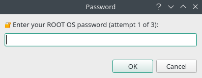
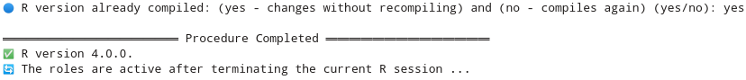
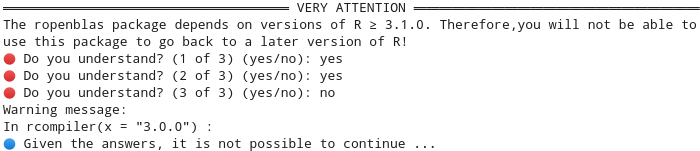
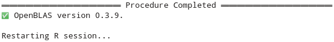
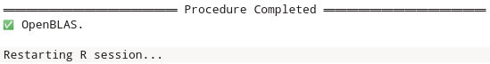

---
# Example from https://joss.readthedocs.io/en/latest/submitting.html
title: 'ropenblas: Download, Compile and Link OpenBLAS Library with R'
tags:
  - R
  - Compiling R and OpenBLAS
  - Link OpenBLAS
  - Switch between versions of R
  - Fast algebraic computing
authors:
  - name: Pedro Rafael Diniz Marinho
    orcid: 0000-0003-1591-8300
    affiliation: 1
affiliations:
 - name: Department of Statistics, Federal University of Paraíba, João Pessoa, Paraíba - PB, Brazil
   index: 1
citation_author: Marinho
date: "`r Sys.Date()`"
year: "`r format(Sys.Date(), '%Y')`"
bibliography: paper.bib
output: rticles::joss_article
header-includes:
  - \usepackage{float}
csl: apa.csl
journal: JOSS
---

# Summary

```{r global_options, include=FALSE}
knitr::opts_chunk$set(fig.pos = 'H')
```

The `ropenblas` package aims to facilitate the day-to-day life of R programmers who want a little more performance on GNU/Linux systems, without removing the possibility that specific configurations are made, if they deem convenient. Through the package's `ropenblas()` and `rcompiler()` functions, the library user will be able to compile and link the R language in his GNU/Linux distribution with the OpenBLAS library, all within R and in a very simple fashion. All functions work without being influenced by the GNU/Linux distribution and are independent of their repositories, that is, it does not matter which GNU/Linux distribution is being used. Linking the OpenBLAS library to R will bring better computational performance to the language in the most diverse algebraic operations commonly used in areas such as statistics, data science, and machine learning.

<!-- # Statement of Need -->

<!-- The `ropenblas` package aims to allow algebraic computing of R to be performed using the OpenBLAS library, that is, it allows easy linking of R to the OpenBLAS library on GNU/Linux systems without depending on the distribution repositories. This will allow several researchers in the areas of statistics, data science, and machine learning to take advantage of more efficient performance in algebraic calculations, for example, multiplication, factorization, and matrix inversion. The `ropenblas` library, version 0.2.9 will also allow the R programmer to have, in his GNU/Linux distribution, several compiled versions of the R language giving the possibility to easily switch between these versions, this being an Open Source functionality that is only possible in some commercial IDEs of R. All this is done within the R language, minimizing the chance of less experienced users to break their operating system by running several instructions that are not perfectly understood. -->

<!-- The fact that the `ropenblas` package does not depend on the repositories of the GNU/Linux distribution will allow that in more stable distributions the R programmer will have at his disposal the most recent version of the OpenBLAS libraries and the R language. Everything is done safely, since the `ropenblas` package uses the stable versions of the official development repositories of the OpenBLAS library and the R programming language, respectively. Until the present version, the package has more than 11000 downloads, having an average of more than 1000 downloads in the month before the date of this submission, based on the official R language repositories. -->

# Introduction

<!-- The term "computational efficiency" is very common for those who program statistical methods, in which a large part of them involve algebraic operations that are often reproduced in computationally intensive simulations, such as Monte-Carlo simulations - MC and resampling methods, as is the case with bootstrap resampling. Statistics is just one example within so many other areas that need performance and uses the R language. -->

<!-- In addition to the adoption of good programming practices and the maximum, efficient and adequate use of available computational resources, such as code parallelization, through multicore parallelism procedures allowed by most current processors and operating systems, small adjustments and linkage of libraries can provide useful benefits. -->

The `ropenblas` package aims to provide useful and simple experiences to R [@R] programmers who develop their activities on GNU/Linux operating systems, these many developers around the world producing codes of great impact for the community. These experiences consist of being able to link any version of the OpenBLAS [@openblas] library to the R language, as well as allowing the programmer to install and link various versions of R and make them available on his operating system as well as switch between these versions as they see fit.

Linking the R language to the OpenBLAS library can bring several benefits to algebraic computing in R. OpenBLAS is an Open-Source implementation of the Basic Linear Algebra Subprograms - BLAS library that is often the first library option for algebraic computing to be linked in the installation of R on many GNU/Linux distributions. The OpenBLAS library is available at <https://github.com/xianyi/OpenBLAS> and adds optimized implementations of linear algebra kernels that can run optimized on various processor architectures. OpenBLAS is based on the GotoBLAS2 project code in version 1.13 [@gotoblas2], code available under the terms of the BSD license.

<!-- The functions of the `ropenblas` package can help the R language user to make this link without leaving the R promprt, as well as allowing the user to choose the version of OpenBLAS to be considered, the last stable version being considered by default . Everything is accomplished by functions without many arguments and without major complications to be used. These functions can be very comforting for users of R on GNU/Linux systems who do not feel safe to run several codes in a terminal that runs Shell Script codes for the language configuration. -->

<!-- It is very common to see users of R in distributions with repositories not prone to immediate updates of programs using several tutorials found in communities on the internet suggesting several lines of code and steps that can be potentially dangerous or easy to be misunderstood by many users of R language. Being able to compile, enable resources if necessary and switch between versions of R using simple functions to be used and without leaving the command pompt of the R language is attractive. -->

<!-- # General package information -->

The `ropenblas` is a package designed to facilitate the linking of the library OpenBLAS with the language R. The package, which works only for Linux systems, will automatically download the latest source code from the OpenBLAS library and compile the code. The package will automatically bind the language R, through the `ropenblas()` function, to use the OpenBLAS library. Everything will be done automatically regardless of the Linux distribution you are using. Enumerating some advantages of the package:

1.  Everything is done within the R language;
2.  The procedure (use of functions) will be the same for any Linux distribution;
3.  The OpenBLAS library will be compiled and you will choose which build version to bind to R, regardless of your Linux distribution;
4.  The package allows you to install R $\geq 3.1.0$, also allowing you to install one more version, in addition to allowing you to easily switch between those versions;
5.  The linked versions of R will continue to be recognized by their Integrated Development Environment - IDE and nothing will have to be adjusted in your GNU/Linux distribution after using any function of the package;
6.  Unnecessary builds will be avoided. Therefore, if you need to switch between compiled versions of the R language, the use of binaries compiled compiled previously will be suggested;
7.  If any errors occur, the functions of the package will not damage the previous installation of the language;
8.  If something better can be done or if a newer version of what you want to install (R or OpenBLAS) exists, the functions will automatically suggest that you should consider installing newer versions.

The `ropenblas` package is already available on the Comprehensive R Archive Network - CRAN, currently in version 0.2.9, and the project is maintained on GitHub at <https://github.com/prdm0/ropenblas> where contributors can find other details of the code, information, as well as being able to contribute with the development of the project. 

<!-- Information can also be found on the project website.  -->

<!-- On the website, it is also possible to read the `NEWS.md` file with details of the versions and the focus of the current development. The site is deposited at <https://prdm0.github.io/ropenblas/>. Suggestions for improvements and bug reports can be sent via the link <https://github.com/prdm0/ropenblas/issues>.  -->

<!-- You can find out how to contribute to the package by accessing the `CONTRIBUTING.md` file at <https://github.com/prdm0/ropenblas/blob/master/CONTRIBUTING.md>. -->

```{r logo, echo = FALSE, message = FALSE, fig.cap = "Computer library logo.", fig.align = "center", out.width="40%"}

knitr::include_graphics(path = "logo.png") 


```

<!-- You can also specify older versions of the OpenBLAS library. Automatically, if no version is specified, the `ropenblas` package will consider the latest version of the library OpenBLAS.  -->

<!-- Considering using the OpenBLAS library rather than the BLAS may bring extra optimizations for your code and improved computational performance for your simulations, since OpenBLAS is an optimized implementation of the library BLAS. -->

<!-- Some of the reasons why it is convenient to link R language to the use of BLAS optimized alternatives can be found here. Several other benchmarks that point to improved computing performance by considering the library OpenBLAS can be found on the internet. -->

<!-- The `ropenblas` package, by `rcompiler()` function is also useful if you want to install different versions of the R language. The different versions, specified by the user of the R language, will be compiled and will also be linked to the OpenBLAS library. If you want to switch between compiled versions of the R language, no compilation is needed anymore. This allows you to avoid having to get your hands dirty with tedious operating system settings, regardless of your GNU/Linux distribution. Another great use of the `rcompiler()` function is that you will not be dependent on updating your GNU/Linux distribution repositories and you can always have the latest version of the R language. -->

<!-- The use of the `ropenblas` package will return warnings that help you proceed with the use of the functions. If your internet is not working or if any dependency on the operating system is not present, the package will let you know. -->

<!-- # Dependencies -->

<!-- In addition to dependencies in the form of other packages deposited with CRAN, the `ropenblas` package depends on external dependencies that are normally installed or are easily installed on any GNU/Linux distribution. Are they: -->

<!--   1. **GNU Make**: GNU Make utility to maintain groups of programs;  -->

<!--   2. **GNU GCC Compiler (C and Fortran)**: The GNU Compiler Collection - C and Fortran frontends. -->

<!-- These programs that are described in `SystemRequirements` in the package's `DESCRIPTION` file are essential for compiling the OpenBLAS library and the R language. The functions of the `ropenblas` package are designed to identify the lack of these dependencies external to CRAN, informing the package user which dependencies are missing and suggesting that they should be installed. The other dependencies indexed to CRAN are described in `Imports` in the file  `DESCRIPTION`. These will be installed automatically. -->

<!-- Other warnings can also be suggested, such as, for example, a problem with the internet connection. All warnings are given very clearly so that the user has no doubts about the problem that may be occurring. -->

# Brief explanation

<!-- # Installation -->

<!-- The `ropenblas` package can be installed in two ways. The first is using the `install.packages()` function of the `utils` package which is available in any basic language installation and the second is using the `devtools` package which will allow the package to be installed directly from the development directory on GitHub. -->

<!-- All code kept in the master branch of the package project on GitHub can be installed, since there will only be codes that are working properly and ready to use. The two forms of installation follow: -->

<!--   1. `install.packages("ropenblas")`: for installing the package available at CRAN; -->

<!--   2. `devtools::install_github(repo = "prdm0/ropenblas, ref = "master", force = TRUE)`: for installing the package from the project development directory on GitHub. -->

<!-- # Exported functions and usage -->

The `ropenblas` library exports six functions for use which are the `rcompiler()`, `ropenblas()`, `last_version_r()`, `last_version_openblas()`, `link_again()` and `rnews()`. All of them are very simple to use and have few arguments that are sufficient to maintain the flexibility of use. Any example that follows will consider that the installation of the `ropenblas` package has been carried out and the package has been loaded (`library(ropenblas)`). Also, functions like `rcompiler()` and `ropenblas()` do not return content or data structures that are of any practical use. What these functions do is configure the GNU/Linux system to use R, configure different versions of the language, switch between versions, and link with the OpenBLAS library. It is also possible to obtain a summary of the versions of R and the OpenBLAS library that are available.

<!-- The following subsections are intended to explain and exemplify the use of these functions focused on the main problems that can be solved using the `ropenblas` package. Some functions may take a few minutes to run, as they are responsible for compiling code that is considerably larges and complicateds. This is the case with the `rcompiler()` and  `ropenblas()` functions. -->

## 'last_version_r' function

The function `last_version_r()` automatically searches, in the official repositories of language R, for information about versions of language R. Its general use is `last_version_r(major = NULL)`, where the argument major indicates which is the largest version of R that you want to search for the version list. Therefore, for argument `major`, a number must be passed, preferably an integer that indicates which is the largest version to be considered.

<!-- Consider the example: -->

<!-- ```{r packages, echo=FALSE, cache=TRUE} -->

<!-- library("ropenblas") -->

<!-- ``` -->

<!-- ```{r, prompt=TRUE, dependson="ropenblas", cache=TRUE, eval=FALSE} -->

<!-- last_version_r(major = 4L) -->

<!-- ``` -->

<!-- Note that the `last_version_r()` function returns a list of three elements, where the first element called `last_version` returns the latest version of the R language based on the argument `major`. Thus, the latest version of the R language since the largest version is $3$ is version $3.6.3$. The second element of name `versions` of the return list is a vector containing all versions of the language R for `major = 3L`. The third and last element of the return list is named `n` and returns an integer value referring to the number of versions of R given `major = 3L`. By default, the `major` argument of the `last_version_r()` function is `NULL`.  -->

<!-- Considering the standard, the function will always consider the largest current version of the language, as in the example below: -->

<!-- ```{r, dependson="ropenblas", cache=TRUE, prompt=TRUE} -->

<!-- last_version_r(major = NULL) -->

<!-- ``` -->

<!-- The function is always adapted to search for new versions and will understand the new language updates since it has been implemented in a general way. Therefore, `last_version_r(major = NULL)$last_version` will always return the latest version of R and not the latest version of R available in the repositories of your GNU/Linux distribution. Therefore, it may be that, depending on when this function is performed, different results may occur. -->

## 'last_version_openblas' function

The `last_version_openblas()` function works similarly to the `last_version_r()` function, returning a list of three elements named in the same way with the information from the latest version, all the versions, and the number of versions of the OpenBLAS library, respectively.

<!-- Unlike the `last_version_r()` function that searches for the versions of R on the official language website, the `last_version_openblas()` function will search for information on the OpenBLAS library versions on official language development repository on GitHub. In addition, due to the way that the versions of the OpenBLAS library are numbered, the function will always consider the universe of all versions of the OpenBLAS library, therefore, being a function without arguments. The latest version of the OpenBLAS library can be returned by doing `last_version_openblas()$last_version`. Just like the `last_version_r()` function, the `last_version_openblas()` function does not depend on which version of OpenBLAS is available in the repositories of your GNU/Linux distribution. -->

<!-- ```{r, dependson="ropenblas", cache=TRUE, prompt=TRUE} -->

<!-- last_version_openblas() -->

<!-- ``` -->

## 'rcompiler' function

This function is responsible for compiling a version of the R language. The x argument is the version of R that you want to compile. For example, `x = "4.0.4"` will compile and link the R-4.0.4 version as the major version on your system. By default (`x = NULL`) will be compiled the latest stable version of the R. For example, to compile the latest stable version of the R language, run `rcompiler()`. The `rcompiler()` function can only be used if the user is an administrator of the GNU/Linux distribution. If the user is using programming IDE's, a screen similar to the image below will be displayed requesting the entry of the system administrator password.

<!-- ```{r, echo=FALSE, message=FALSE, warning=FALSE, fig.align='center', fig.cap="Window for entering the system administration password.", out.width="55%"} -->

<!--  -->

<!-- ``` -->

<!-- If the user is running the R language in a terminal of the GNU/Linux distribution, a Shell Bash type terminal, they will be asked to include the password by the terminal itself. The function will not change the operation of other programs, nor even major changes will be made in the initial version of R, just summarizing the creation of symbolic links. -->

<!-- The general way of using the function is given by: -->

<!-- **General use**: -->

```{r, eval=FALSE, prompt=TRUE}
rcompiler(x = NULL, with_blas = NULL, complementary_flags = NULL)
```

<!-- The function's arguments are described below: -->

-   `x`: String with a valid R language version. A list valid of the latest language versions can be obtained using the `last_version_r()` function. You can move to `x` any of the returned versions. This is the best way to choose a valid argument for `x`. By default, `x = NULL` is equivalent to pass `last_version_r()$last_version`, that is, it will be considered the last stable version of the R language;
-   `with_blas`: This argument sets the `--with-blas` flag in the R language compilation process and must be passed as a string. Details on the use of this flag can be found here;
-   `complementary_flags`: String with complementary flags to be used in the R language compilation process.

If the goal is to install the R language, switch between versions of R, and link the installed versions of the language with the OpenBLAS library, you shouldn't have to worry about the `with_blas` and `complementary_flags` arguments, respectively. For more details, consult the `README.md` of the project or the official documentation of the package in [CRAN](https://cran.r-project.org/web/packages/ropenblas/ropenblas.pdf).

<!-- These arguments are useful for a minority of programmers who feel very specific needs to pass complementary flags to be considered in the R language compilation process, the inclusion of complementary library directories, among other arguments that can be found in the official language manuals. By default, if nothing is passed to the `with_blas` and `complementary_flags` arguments, the compilation will be performed as follows: -->

<!-- ```{bash, eval=FALSE} -->

<!-- ./configure --prefix=/opt/R/version_r --enable-memory-profiling -->

<!-- --enable-R-shlib --enable-threads=posix -->

<!-- --with-blas="-L/opt/OpenBLAS/lib -I/opt/OpenBLAS/include -lpthread -lm" -->

<!-- ``` -->

<!-- As a suggestion and if you want to use the complementary arguments, that is, use `with_blas` and `complementary_flags`, do not change the directory `include` and `lib` of the OpenBLAS library in argument `with_blas`, considering that the `rcompiler()` function will always install the OpenBLAS library in the `/opt/OpenBLAS` directory, thus avoiding problems with breaking important links on your system and in the configuration of the initial version of R. If you try to pass a different installation directory to the OpenBLAS library, the `rcompiler()` function will disregard this installation of OpenBLAS and perform a safe installation in the `/opt/OpenBLAS` directory. Everything is built in this directory and symbolic links are used so that the initial state of R configuration in the GNU/Linux distribution is not changed. This allows no errors to be made and unforeseen bugs to occur. If there are reasons to consider complementary strings for the arguments `with_blas` and `complementary_flags`, the R language will be compiled as follows: -->

<!-- ```{bash, eval=FALSE} -->

<!-- --prefix=/opt/R/version_r --enable-memory-profiling --enable-R-shlib -->

<!-- --enable-threads=posix --with-blas="..." complementary_flags -->

<!-- ``` -->

<!-- Although the initial description of the `rcompiler()` function may seem a little complicated, its use is very simple. Below I will exemplify some situations in which the use of the `rcompiler()` function may be convenient. -->

<!-- **Example**: In the hypothetical situation of an R user on any GNU/Linux distribution, if are interested in knowing the latest version of the R language, installing it and linking it to the OpenBLAS library, it should proceed as follows: -->

<!-- ```{r, eval=FALSE, prompt=TRUE} -->

<!-- rcompiler(x = "4.0.2") # or simply rcompiler () or rcompiler (x = NULL) -->

<!-- ``` -->

<!-- After executing the function, everything will be ready, and can be checked by executing the command `extSoftVersion()["BLAS"]` in the next execution of R, that is, in a new instance. Thus the user will know that the compilation of the R library, and if necessary, of the OpenBLAS library was carried out as requested. Briefly, the `extSoftVersion()["BLAS"]` command will return something like: -->

<!-- ```{r, prompt=TRUE} -->

<!-- extSoftVersion()["BLAS"] -->

<!-- ``` -->

<!-- ```{r, prompt=TRUE} -->

<!-- sessionInfo() -->

<!-- ``` -->

<!-- **Example**: In a new hypothetical situation of a user of R having installed two different versions of the R language as presented above, using the function `rcompiler()`, for example, versions 3.6.3 and 4.0.0, so: -->

<!-- ```{r, eval=FALSE, prompt=TRUE} -->

<!-- # First installation of R performed by the rcompiler() function: -->

<!-- rcompiler(x = "4.0.0")  -->

<!-- # Second installation of R performed by the rcompiler() function: -->

<!-- rcompiler(x = "3.6.3") -->

<!-- # Returning version 4.0.0 from R: -->

<!-- rcompiler(x = "4.0.0") -->

<!-- ``` -->

<!-- Running the code `rcompiler(x = "4.0.0")` as the last line of the example above will allow the user to link the binaries previously created in the 4.0.0 compilation process when `rcompiler(x = "4.0.0")` was run for the first time. This will avoid a compilation so that switching between versions of R that have already been compiled will be quick and easy. Although this seems ideal and it is, the function will ask if the user wants to recompile an already compiled version. -->

<!-- **Example**: Assuming that the user of the package has already used the function `rcompiler(x = "4.0.0")` and is in a version other than 4.0.0 but intends to return to version 4.0.0, he can return without compile the language again, as shown in the image below. The output was placed in the form of an image since the return of the functions of the package use symbols that facilitate the user of the functions of the package to understand the suggestions, as well as understand if something went right or wrong. -->

<!-- ```{r, eval=FALSE} -->

<!-- rcompiler(x = "4.0.0") -->

<!-- ``` -->

<!-- ```{r, echo=FALSE, message=FALSE, warning=FALSE, fig.align='center', fig.cap="A possible exit from the 'rcompiler' function. Suggestion of switching between versions of R without the need to recompile the language.", out.width="100%"} -->

<!--  -->

<!-- ``` -->

<!-- Due to the internal dependencies of the `ropenblas` package, it is advisable not to try to go to versions of R prior to 3.1.0, as these dependencies do not work on these versions of R. Therefore, in earlier versions of R, installing the `ropenblas` package will not be possible. Therefore, if the user wishes to return to a more current version of R, he must install the language R in the GNU/Linux distribution without the help of the package. Although it is allowed to install previous versions of R prior to 3.1.0, it will only be done after the user responds to some questions of an alert message, as shown in the image below: -->

<!-- ```{r, eval=FALSE, prompt=FALSE} -->

<!-- rcompiler(x = "3.0.0") -->

<!-- ``` -->

<!-- ```{r, echo=FALSE, message=FALSE, warning=FALSE, fig.align='center', fig.cap="Attempted to install an R language version prior to version 3.1.0.", out.width="100%"} -->

<!--  -->

<!-- ``` -->

## 'ropenblas' function

The `ropenblas()` function, a function of the same name in the package, links the main version of the R language installed on your operating system with the OpenBLAS library. As in the `rcompiler()` function, the `ropenblas()` function requires the operating system administration password, that is, it must be executed by the system administrator.

<!-- Unlike the `rcompiler()` function that will allow multiple versions of R to be available in your GNU/Linux distribution, the `ropenblas()` function will allow only one version of the OpenBLAS library to be installed. The function will allow versions of OpenBLAS $\geq 0.3.0$ to be installed. Even if the function `rcompile()` responsible for compiling and installing the R language has not been used, the function `ropenblas()` may link a version of OpenBLAS to the main installation of R, that is, even if the R is installed by procedures external to the package. -->

<!-- **General use**: -->

```{r, eval = FALSE, prompt=TRUE}
ropenblas(x = NULL, restart_r = TRUE)
```

The `ropenblas()` function is made up of two arguments. Are they:

-   `x`: String with the version of the OpenBLAS library to be compiled, installed, and linked with the main R installation (by default it is considered the latest version);
-   `restart_r`: Logical value (default `restart_r = TRUE`) to update the R section after compiling, installing, and linking the OpenBLAS library.

<!-- By default, if `x = NULL` the latest version of the OpenBLAS library will be considered. This is equivalent to passing `last_version_openblas()$last_version` to `x`. There are no great reasons to consider an older version of the OpenBLAS library, although the `ropenblas` package will allow this to be done in a simple way, as in the following example:  -->

<!-- **Example**: Regardless of how the R language was installed, suppose you want to compile, install and link the latest version of the OpenBLAS library to the R language. This can be done by doing: -->

<!-- ```{r, eval=FALSE, prompt=TRUE} -->

<!-- ropenblas() -->

<!-- ``` -->

<!-- ```{r, echo=FALSE, message=FALSE, warning=FALSE, fig.align='center', fig.cap="Output informing the end of the procedure for linking the OpenBLAS library to the R language.", out.width="100%"} -->

<!--  -->

<!-- ``` -->

<!-- **Example**: In situations where the latest version of the OpenBLAS library is already installed, if the user wishes to install a previous version of OpenBLAS, for example the version $0.3.8$, he should make it clear by answering a question, as shown in the image below: -->

<!-- ```{r, eval=FALSE, prompt=TRUE} -->

<!-- ropenblas("0.3.8") -->

<!-- ``` -->

<!-- ```{r, echo=FALSE, message=FALSE, warning=FALSE, fig.align='center', fig.cap="Asking if the user really wants to compile and link an older version of the OpenBLAS library.", out.width="100%"} -->

<!--  -->

<!-- ``` -->

Table 1 below presents the benefit of considering an optimized version of BLAS. Computational costs are presented in the calculation of the singular decomposition in a rectangular matrix (`svd()` function) and in the calculation of the inverse of that same matrix (`solve()` function). Some repetitions (100 repetitions) of each of the respective functions were performed. The benchmark can be better observed through the violin plots shown in Figure 2.

\

| Functions  | Library  | Time (seconds) |
|----------- |----------|:---------------:|
| `svd(x)`   | BLAS     | 6.520      |
| `svd(x)`   | OpenBLAS | 0.641     |
| `solve(x)` | BLAS     | 1.640      |
| `solve(x)` | OpenBLAS | 0.640      |
: Comparison of the computational costs of the `svd()` and `solve()` functions (average of 100 repetitions).

Through a benchmark it is possible to better understand the performance gain that can be achieved by linking the R language to the OpenBLAS library. Figure 2 presents the benchmarks in the form of a violin plot, in which 100 reproductions of the `svd(X)` expression were considered, in the form of the code above, with the R linked to the BLAS library and linked to the OpenBLAS library, respectively, on the same hardware. It was observed that the average time of execution of the routine `svd(X)` considering the OpenBLAS library was less than 10 times the time necessary to execute it in R linking to a non-optimized version of BLAS, being the average time of 0.64 and 6.52 seconds, respectively.

```{r bench, echo = FALSE, fig.cap = "Benchmarks of a decomposition of singular and inverse value of a matrix of dimension 1000 x 1000.", fig.align = "center", out.width="60%"}
knitr::include_graphics(path = "benchmark.png") 
```

## 'link_again' function

The `link_again()` function links again the OpenBLAS library with the R language, being useful to correct problems of untying the OpenBLAS library that is common when the operating system is updated. The function can link again the R language with the OpenBLAS library.

Thus, `link_again()` will only make the linkage when in some previous section of R the `ropenblas()` function has been used for the initial binding of the R language with the OpenBLAS library.

<!-- The use of the function is quite simple, just by running the code `link_again()` since the function has no arguments. It will automatically detect if there was a link break that will be rebuilt again without the need for any compilation. From time to time, after a major update of the operating system, it may be convenient to run the `link_again()` function. Link breakage rarely occurs, but if it does, it can be resolved quickly. The following code and image exemplify a possible reconstruction of symbolic links using the `link_again()` function: -->

<!-- ```{r, eval=FALSE, prompt=TRUE} -->
<!-- link_again() -->
<!-- ``` -->

<!-- ```{r, echo=FALSE, message=FALSE, warning=FALSE, fig.align='center', fig.cap="If an unlinking of the OpenBLAS library occurs, the function will re-link the library.", out.width="100%"} -->

<!--  -->

<!-- ``` -->

<!-- Running the `link_again()` function in a situation where there is no need will not generate problems. The function will return the message that everything is linked correctly, according to the code and image that follows: -->

<!-- ```{r, echo=FALSE, message=FALSE, warning=FALSE, fig.align='center', fig.cap="If relinking is not required, the function will make it clear.", out.width="100%"} -->

<!--  -->

<!-- ``` -->

## 'rnews function'

The `rnews()` function returns the contents of the `NEWS.html` file in the standard browser installed on the operating system. The `NEWS.html` file contains the main changes from the recently released versions of the R language. The goal is to facilitate the query by invoking it directly from the R command prompt.

<!-- The `rnews()` function is analogous to the news function of the `utils` package. However, using the news command in a terminal style bash shell is possible to receive a message like: -->

<!-- ```{r, eval=FALSE} -->

<!-- news() -->

<!-- ## starting httpd help server ... done -->

<!-- ## Error in browseURL(url): 'browser' must be a non-empty character string -->

<!-- ``` -->

<!-- If `pdf = FALSE` (default), the `NEWS.html` file will open in the browser, otherwise `NEWS.pdf` will be opened. If `dev = FALSE` (default), it will not show changes made to the language development version. To see changes in the development version, do `dev = TRUE`. -->

# Improvements

The package will continue to evolve and code reviews will always be carried out. In addition, contributions to the development of the package are always welcome, especially those that aim to allow the `rcompiler()` and `ropenblas()` functions to work on Windows systems. There is also an interest that the `ropenblas` package will allow the linking of the Intel Math Kernel Library - MKL, just as it is done with the OpenBLAS library. All of these are improvements that we would like to see in future versions of the package.

# References
